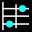

  
  <h1><a href="https://chords.stray.codes">Chordinator</a></h1>
  
A tool to visualize chords and intervals on string instruments.

## How to use?
Select your instrument on the bottom right of the screen, there are more instruments accessible through the + icon.
Then select whatever chord/sequence/interval you wan't to visualize on the bottom left of the screen.
Then just hover over any note on the keyboard or string instrument. Once you are happy with your selection just press space
to lock your selection. Enjoy!

## FAQ
 - Why does this program exist?
 > Because I could not find a similar tool and needed one myself, so I just made it.
I am sharing it for free as I already used a lot of free resources to study the Bass and it felt only right to give something back.

 - Does this website have cookies or collect user data?
> No and it never will. No login, no account, no database.

 -  Can you add string instrument/chord/sequence?
> Of course, just either create a PR or raise an issue. Check out the ['data'](https://github.com/stray-codes/chordinator/tree/main/data) folder for more info.

 -  Can you add a new feature?
> Depends, if I benefit from it myself and have the time and capacity to implement it, then YES.

## Building Project and Selfhosting
This project was made with [Preact](https://preactjs.com/).

-   `pnpm run dev` - Starts a dev server at http://localhost:5173/

-   `pnpm run build` - Builds for production, emitting to `dist/`

-   `pnpm run preview` - Starts a server at http://localhost:4173/ to test production build locally

